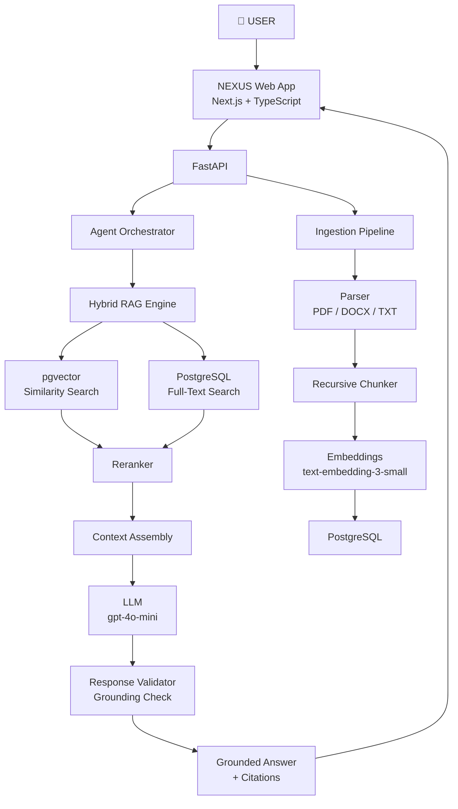

# NEXUS — Personal Context Engine

> A privacy-first AI that understands your personal information, connects context across sources, answers questions with evidence, and proactively helps you act.

NEXUS is not a chatbot. It is a **Personal Context Engine** — a system that ingests your documents, emails, calendar events, and other personal data, then uses Agentic RAG (Retrieval-Augmented Generation) to answer questions with evidence, detect important events, and eventually take actions on your behalf.

---

## Architecture



---

## RAG Pipeline

### Ingestion
```
Upload → MIME Validate → Parse → OCR (if needed) → Clean → 
Chunk (512 tokens, 128 overlap) → Embed → Extract Entities & Events → Store
```

### Retrieval
```
Query → Embed → Vector Search + Full-Text Search → Merge → 
Metadata Filter → Rerank → Context Assembly
```

### Generation
```
Context + System Prompt (grounding rules) + Query → 
LLM → Parse Citations → Structured Response
```

---

## Tech Stack

| Layer | Technology |
|-------|-----------|
| Frontend | Next.js 15, TypeScript, Tailwind CSS, Radix UI |
| Backend | Python 3.12, FastAPI, Pydantic v2 |
| Database | PostgreSQL 16 + pgvector |
| Migrations | Alembic |
| ORM | SQLAlchemy 2.0 (async) |
| Embeddings | OpenAI text-embedding-3-small |
| LLM | OpenAI gpt-4o-mini |
| Reranking | sentence-transformers cross-encoder |
| Containerization | Docker Compose |

---

## Directory Structure

```
nexus/
├── apps/
│   ├── web/                  # Next.js frontend
│   └── api/                  # FastAPI backend
│       ├── app/
│       │   ├── core/         # Config, DB, Security, Logging
│       │   ├── models/       # SQLAlchemy models
│       │   ├── schemas/      # Pydantic schemas
│       │   └── routes/       # API endpoints
│       ├── alembic/          # Database migrations
│       └── tests/
│
├── services/
│   ├── ingestion/            # Document parsing pipeline
│   ├── retrieval/            # Hybrid search
│   ├── reranking/            # Reranker abstraction
│   ├── memory/               # Personal knowledge graph
│   ├── agents/               # Agent orchestrator
│   ├── temporal/             # Time-aware reasoning
│   └── intelligence/         # Proactive insight engine
│
├── infrastructure/
│   ├── database/             # init.sql (extensions)
│   └── docker/               # Dockerfiles
│
├── tests/                    # Integration and eval tests
├── scripts/seed/             # Demo dataset seeding
└── docker-compose.yml
```

---

## Local Setup

### Prerequisites
- Docker + Docker Compose
- Node.js ≥ 18
- Python 3.12 + uv
- OpenAI API key

### 1. Clone and configure

```bash
git clone https://github.com/Puneesh12/nexus.git
cd nexus
cp .env.example .env
# Edit .env — set OPENAI_API_KEY and change secret keys
```

### 2. Start the database

```bash
docker compose up postgres -d
```

### 3. Run the backend

```bash
cd apps/api
uv sync
uv run alembic upgrade head
uv run uvicorn app.main:app --reload --port 8000
```

### 4. Run the frontend

```bash
cd apps/web
npm install
npm run dev
```

Open [http://localhost:3000](http://localhost:3000)

### Full stack with Docker Compose

```bash
# Copy and configure .env first
docker compose up --build
```

---

## Environment Variables

See [.env.example](./.env.example) for all variables.

**Required:**
- `OPENAI_API_KEY` — OpenAI API key for embeddings and generation
- `APP_SECRET_KEY` — Random 64-char secret for session signing
- `JWT_SECRET_KEY` — Random 64-char secret for JWT tokens
- `POSTGRES_PASSWORD` — Database password

**Never commit `.env` to Git.**

---

## Database Setup

```bash
# Run migrations
uv run alembic upgrade head

# Roll back one migration
uv run alembic downgrade -1

# Generate a new migration after model changes
uv run alembic revision --autogenerate -m "description"
```

---

## Testing

```bash
# Backend tests
cd apps/api
uv run pytest tests/ -v --cov=app

# Frontend type check
cd apps/web
npm run type-check

# RAG evaluation (Milestone 6+)
python scripts/eval/run_eval.py
```

---

## Security

NEXUS handles personal information. Key security measures:

- **JWT authentication** — all document and query endpoints require auth
- **Per-user isolation** — every database query is scoped by `user_id`
- **Upload validation** — MIME type, file size, and extension enforcement
- **Prompt injection defense** — retrieved document content is clearly delimited from system instructions in all LLM prompts
- **No secrets in logs** — structured logging never includes API keys or tokens
- **Environment secrets only** — no hardcoded credentials anywhere

---

## Roadmap

| Milestone | Status |
|-----------|--------|
| 1. Foundation — repo, API, frontend, DB | ✅ Complete |
| 2. Document Intelligence — parsing, chunking, embeddings | 🔄 In Progress |
| 3. Real RAG — hybrid search, reranking, citations | 📋 Planned |
| 4. Personal Memory — entities, relationships, events | 📋 Planned |
| 5. Agent Orchestrator — planner, tool router | 📋 Planned |
| 6. Proactive Intelligence — deadline detection, insights | 📋 Planned |
| 7. Integrations — Google Drive, Gmail, Calendar | 📋 Planned |

---

## Contributing

This repository represents Puneesh Gulati's personal project. All commits are authored by Puneesh12.
